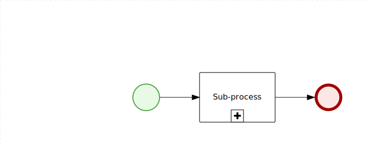

Sample Business Central project to show how to use Reusable Sub-Process
=======================

Clone this project to the Business Central and execute `VariableCalledElement` or `PrintToConsoleCallingExternalProcess` processes.

Both of them looks like:

* `PrintToConsoleCallingExternalProcess` uses hard coded Process ID of `CallableProcess` so everytime you execute `PrintToConsoleCallingExternalProcess` you will also execute `CallableProcess`.
* `VariableCalledElement` uses variable to determine wich process should be executed. During start time you will be asked  wich one process you want to execute `SayGoodbye` or `SayHelloWorld`.
